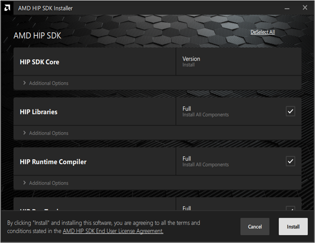

# Quick Start (Windows)

The steps to install the HIP SDK for Windows are described in this document.

## System Requirements

The HIP SDK is supported on Windows 10 and 11. The HIP SDK may be installed on a
system without AMD GPUs to use the build toolchains. To run HIP applications, a
compatible GPU is required. Please see the supported GPU guide for more details.
TODO: provide link to supported GPU guide.

## SDK Installation

Installation options are listed in Table 1.

| **Table 1. Components for Installation** |||                                                                                                                                                                                                      |
|:------------------------:|:----------------:|:------------------:|:------------------------------------------------------------------------------------------------------------------------------------------------------------------------------:|
| **HIP Components**       | **Install Type** | **Display Driver** | **Install Options**                                                                                                                                                            |
| **HIP SDK Core**         | **Full**         | Adrenalin 22.40    | **Full:** Provides all AMD Software features and controls for gaming, recording, streaming, and tweaking your performance on your graphics hardware.                           |
| **HIP Libraries**        | **Full**         |                    | **Minimal:** Provides only the basic controls for AMD Software features and does not include advanced features such as performance tweaking or recording and capturing content.|
| **HIP Runtime Compiler** | **Full**         |                    | **Driver Only:** Provides no user interface for AMD Software features.                                                                                                         |
| **Ray Tracing**          | **Full**         |                    | **Do Not Install**                                                                                                                                                             |
| **BitCode Profiler**     | **Full**         |                    |                                                                                                                                                                                |

TODO: describe each installation option.

## HIP SDK Installer

The AMD HIP SDK Installer manages the installation and uninstallation process of
HIP SDK for Windows. This includes system configuration checks, installing
components, and installing the display driver.

To launch the AMD HIP SDK Installer, click the **Setup** icon shown in Figure 1.
The installer will begin to load and detect your system's configuration and
compatibility, as shown in Figure 2. A completely loaded AMD HIP SDK Installer
window will appear, as shown in Figure 3.

|  |
|:----------------------------------------------------:|
| **Figure 1. Setup Icon**                             |

|  |
|:-----------------------------------------------------------------:|
| **Figure 2. AMD HIP SDK Loading Window**                          |

|  |
|:---------------------------------------------------------------------:|
| **Figure 3. AMD HIP SDK Installer Window**                            |

### Installation Selections

By default, all components are selected for installation. Refer to Figure 3 for
an instance when the Select All option is turned on.

**Note** The Select All option only applies to the installation of HIP
components. To install the AMD Display Driver, manually select the install type.

**Note** To customize the install location on your system, click
**Additional Options** under HIP SDK Core and AMD Radeon Vega 10 Graphics. Refer
to the sections [HIP Components](#hip-components) and
[AMD Display Driver](#amd-display-driver) for more information on each
installation.

To make installation selections and install, follow these steps:

1. Scroll the window to AMD Display Driver and select the desired install type.
Refer to the section [AMD Display Driver](#amd-display-driver) for more
information on installation types.
2. Once selected, click **Install** located in the lower right corner, and skip
to [Installing Components](#installing-components).

#### Deselect All

To select individual component installs onto your system click **Deselect All**
in the upper right corner of the installer window, as seen in Figure 3. Figure 4
demonstrates the installer window once the installation components are all
deselected.

|  |
|:------------------------------------------------------------:|
| **Figure 4. Deselect All Selection**                         |

#### HIP Components

By default, each HIP component will be checked off for full installation,
Figures 4 through 8 demonstrate the options available to you when you click
**Additional Options** under each component.

| **Table 2. Custom Selections for Installation**                   |                                                      |
|:------------------------------------------------------------------|:---------------------------------------------------- |
| **If:**                                                           | **Then:**                                            |
| You intend to make custom selections for this installation        | Skip to the section _Deselect All_.                  |
| You do not intend to make custom selections for this installation | Continue to the section _AMD Display Driver_.        |

**Note** You can manually select installation locations for the HIP SDK Core, as
shown in Figure 5.

|  |
|:-------------------------------------------------------------:|
| **Figure 5. HIP SDK Core Option**                             |

|  |
|:---------------------------------------------------------------:|
| **Figure 6. HIP Libraries Option**                              |

|  |
|:-----------------------------------------------------------------------------:|
| **Figure 7. HIP Runtime Compiler Option**                                     |

|  |
|:-------------------------------------------------------------------:|
| **Figure 8. HIP Ray Tracing**                                       |

|  |
|:---------------------------------------------------------------------:|
| **Figure 9. BitCode Profiler**                                        |

#### AMD Display Driver

The AMD Display Driver offers three install types:

- Full Install
- Minimal Install
- Driver only

Table 3 describes the difference in each option shown in Figure 10.

**Note** You must perform a system restart for a complete installation of the
Display Driver.

**Note** Unless you intend to factory reset your machine, leave the
**Factory Reset (Optional)** box unchecked. A Factory Reset will remove all
prior versions of AMD HIP SDK and drivers. You will not be able to roll back to
previously installed drivers.

| **Table 3. Display Driver Install Options** |                                                                                                                                            |
|:-------------------:|:------------------------------------------------------------------------------------------------------------------------------------------------------------------:|
| **Install Option**  | **Description**                                                                                                                                                    |
| **Full Install**    | Provides all AMD Software features and controls for gaming, recording, streaming, and tweaking the performance on your graphics hardware.                          |
| **Minimal Install** | Provides only the basic controls for AMD Software features and does not include advanced features such as performance tweaking or recording and capturing content. |
| **Driver Only**     | Provides no user interface for AMD Software features.                                                                                                              |

|  |
|:---------------------------------------------------------------------:|
| **Figure 10. AMD Display Driver Options**                             |

## Installing Components

Please wait for the installation to complete during as shown in Figure 11.

|  |
|:-----------------------------------------------------------:|
| **Figure 11. Active Installation**                          |

### Installation Complete

Once the installation is complete, the installer window may prompt you for a
system restart. Click **Restart** at the lower right corner, shown in Figure 12.

|  |
|:-------------------------------------------------------------------------------:|
| **Figure 12. Installation Complete**                                            |

## Uninstallation

All components, except visual studio plug-in should be uninstalled through
control panel -> Add/Remove Program. For visual studio extension uninstallation,
please refer to
<https://github.com/ROCm-Developer-Tools/HIP-VS/blob/master/README.md>. For the
uninstallation of the HIP SDK Core and drivers repeat the steps in the sections
[HIP SDK Installer](#hip-sdk-installer) and
[Installing Components](#installing-components).

**Note** Selecting **Install** once ROCm has already installed results in its
uninstallation.

|  |
|:------------------------------------------------------------:|
| **Figure 13. HIP SDK Uninstalling**                          |
